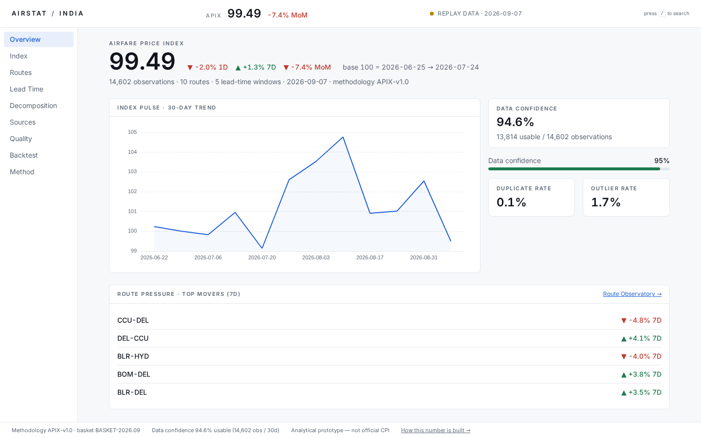
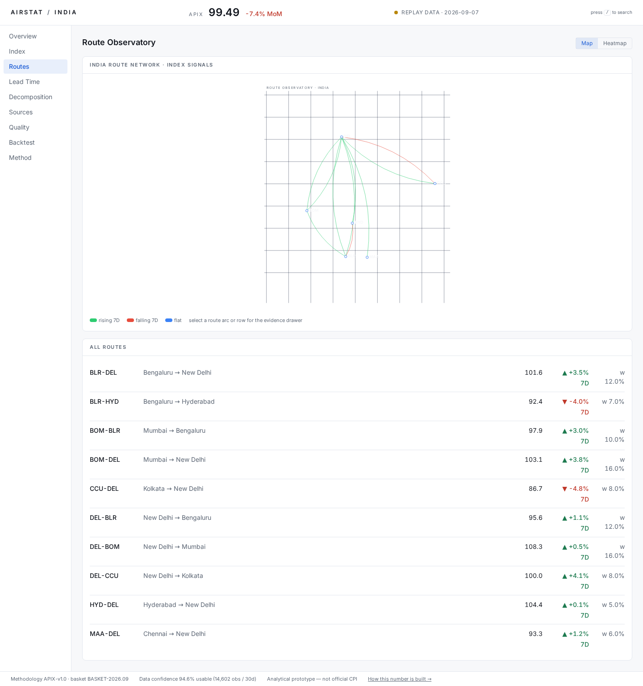
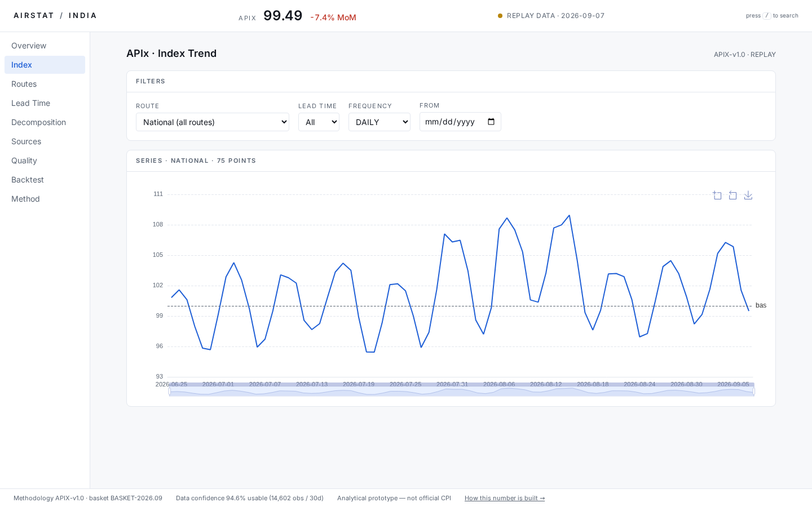
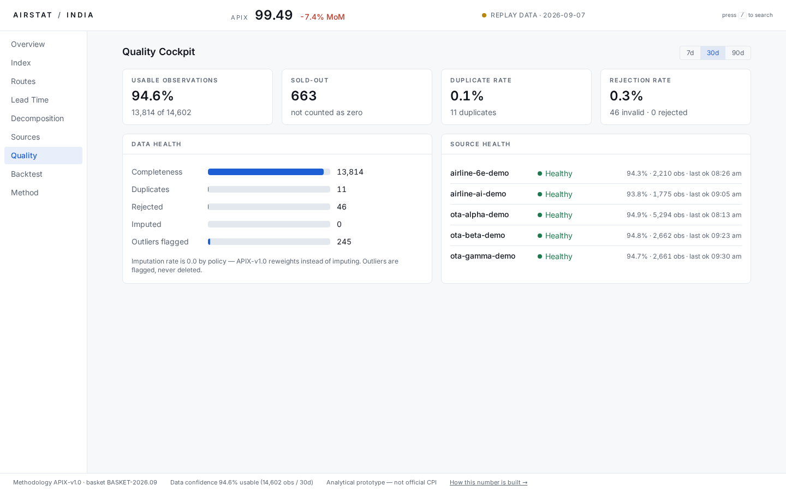
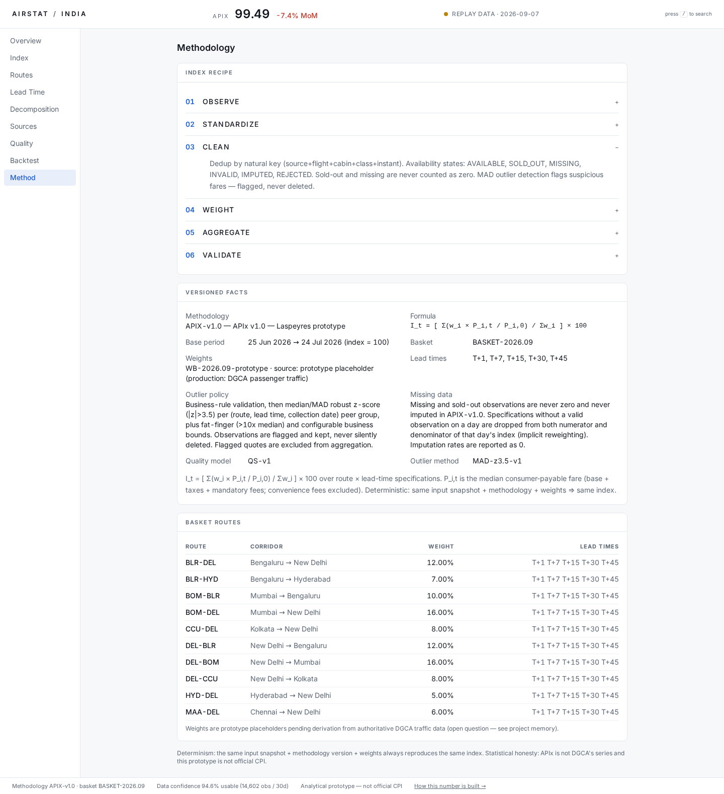
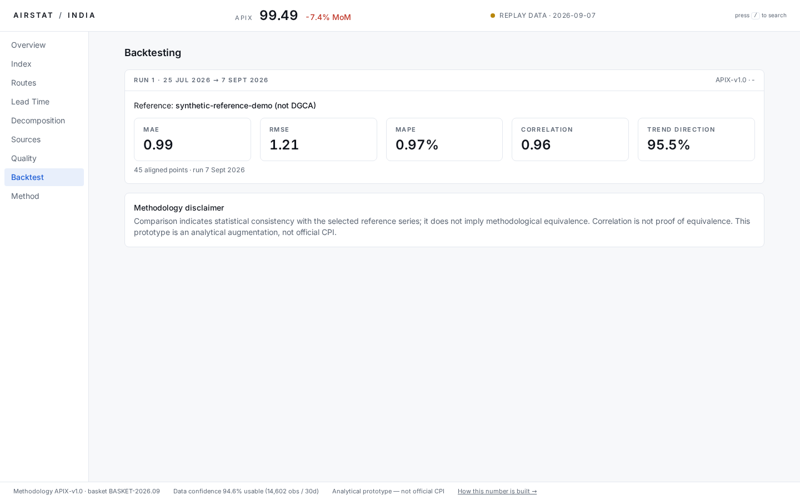

# AirStat India

**A real-time Airfare Price Index (APIx) platform for India.**

Built for **Smart India Hackathon 2026** — Problem Statement 26056, Ministry of Statistics and Programme Implementation (MoSPI) / Data Innovation and Institution Development (DIID).


---

Airfare prices in India change by the hour, but official price statistics arrive with long lags. AirStat India closes that gap: it converts continuously collected fare observations into a **deterministic, reproducible, versioned price index (APIx)** — built the way a national statistical agency would build one, and published with its full evidence trail: data confidence, outlier rates, source health, and historical backtests.

The platform is honest by design. Every published number carries its methodology version, basket version, weight version, and a live indicator of whether it was produced from live, demo, or replay data.

## Screenshots

| | |
|---|---|
|  |  |
| **Overview** — APIx pulse, 30-day trend, route pressure, data confidence | **Route Observatory** — index signals across the India route network |
|  |  |
| **Index Explorer** — national and per-route index series with filters | **Data Quality** — availability states, duplicates, outliers, source health |
|  |  |
| **Methodology** — the full published recipe, versioned facts | **Backtesting** — accuracy metrics against a reference series |

## What the platform does

| Capability | Detail |
|---|---|
| Deterministic index engine | Pure-Python Laspeyres-style calculation — same input snapshot plus methodology version and weights always yields the same index. No LLM or opaque model touches the official number. |
| Canonical data model | Every observation from every source maps to one validated schema; raw observations are immutable (RAW to PROCESSED to INDEX, never overwritten). |
| Quality scoring | Every observation carries a quality score; availability is modelled explicitly as AVAILABLE, SOLD_OUT, MISSING, INVALID, IMPUTED, or REJECTED. Missing and sold-out fares are never counted as zero. |
| Outlier policy | MAD-based detection flags suspicious fares — flagged for review, never silently deleted. An expensive fare is not automatically an outlier. |
| Replay-first operation | A seeded 12-month replay dataset (72,010 jobs, 185,000+ observations, 10 trunk routes, 5 advance-purchase windows) means the dashboard and every demo work without live scraping. |
| Backtesting | MAE, RMSE, MAPE, correlation, and trend-direction accuracy against the official MoSPI CPI Airfare sub-index — the replay window covers all 6 published months of the series, so the monthly-mean comparison aligns on every available official point. |
| Evidence-first dashboard | Eleven screens in an "Airspace Observatory" design: every figure links back to its methodology, sample size, and data confidence. |
| Versioned everything | Methodology, route basket, weights, processor, adapters, and calculation runs are all versioned and queryable through the API. |
| Ethical collection contract | Adapters respect robots.txt and terms of service, rate-limit, time out, retry with backoff (bounded, never on policy stops), detect CAPTCHA/Cloudflare/Akamai and pause on restriction. No bypass of any access control, ever. |
| JS-rendered collection | An optional Playwright path renders JavaScript fare pages through the identical compliance gate (robots → rate limit → render → CAPTCHA detect → pause), demonstrated live on the local sim portal's JS endpoint. |
| Scheduled daily extraction | `scripts/schedule_collect.py` runs the daily collect → clean → index cycle at 08:00 IST (APScheduler, idempotent job keys — cron equivalent: `0 8 * * *`). |
| Honest source registry | Every PS-named airline/OTA appears on the Sources screen with its frozen compliance verdict (restricted / rejected with the verbatim robots.txt evidence) — absence is documented diligence, never silence. |

## How it works

```
Observe -> Validate -> Normalize -> Quality-score -> Aggregate -> Explain -> Backtest -> Publish
```

| Stage | Component | What happens |
|---|---|---|
| Observe | `collectors/` | Source adapters map airline/OTA quotes into the canonical schema and stop there — collection never computes statistics. |
| Validate | `backend/app/services/pipeline.py` | Schema, fare-component consistency, and deduplication by natural key (source + flight + cabin + class + instant). |
| Normalize | `statistical_engine/normalization.py` | Fare decomposition into base fare, taxes, mandatory fees, and convenience fees; the consumer-payable fare is the priced quantity. |
| Quality-score | `statistical_engine/quality.py` | Per-observation quality scoring and availability-state assignment. |
| Aggregate | `statistical_engine/aggregation.py` | Daily spec prices (route x advance-purchase window) from usable observations. |
| Explain | `/api/v1/methodology` | The full recipe published as machine-readable facts: formula, base period, basket, weights, outlier and missing-data policies. |
| Backtest | `statistical_engine/backtest.py` | Accuracy metrics against a reference series over the replay window. |
| Publish | `backend/app/api.py` + `frontend/` | Read-only REST API and the React dashboard. |

## Index methodology

$$I_t = \left[\ \frac{\sum_i w_i \cdot (P_{i,t} / P_{i,0})}{\sum_i w_i}\ \right] \times 100$$

A fixed-basket Laspeyres-style index where each specification $i$ is a route x advance-purchase window, $w_i$ is its specification weight, $P_{i,t}$ is the current median spec price and $P_{i,0}$ the base-period price.

- **Deterministic and reproducible.** The engine computes an input fingerprint over every input snapshot; the same snapshot, methodology version, and weights always reproduce the same series. No ML, no randomness, no hidden heuristics in the official calculation.
- **Missing data is reweighting, not imputation.** A spec with no valid observation on a given day drops out of both numerator and denominator — a documented, honest policy rather than a fabricated value.
- **Sold-out is not zero.** Availability states keep sold-out and missing fares distinct from observed prices.
- **Flagged, never deleted.** MAD-based outlier detection marks suspicious observations with reasons; raw data stays untouched.
- **Base period:** 2025-08-25 to 2025-09-23 (index = 100). Methodology `APIX-v1.0`, basket `BASKET-2026.09`, weights `WB-2026.09-DGCA` (DGCA DOM city-pair passenger shares, July 2026).

## Architecture

```
   Source Adapters (collectors/)        Replay Dataset (data/fixtures/)
        |  canonical schema                     |
        +---------------+-----------------------+
                        v
             Raw Observation Store          (immutable)
                        |
             Validation  ->  Normalization
                        |
                Quality Engine         (scores, availability states, MAD outliers)
                        |
             Statistical Engine        (deterministic APIx, versioned runs)
                        |
        +---------------+----------------+----------------+
        v               v                v                v
   REST API        Dashboard        Backtesting      CSV Export
   (FastAPI)      (React+ECharts)  (metrics)       (/api/v1/fares.csv)
```

| Layer | Technology |
|---|---|
| API | Python 3.10+, FastAPI, Pydantic v2, OpenAPI/Swagger at `/docs` |
| Persistence | SQLAlchemy 2, SQLite by default, PostgreSQL via `DATABASE_URL` |
| Statistical engine | Pure Python (standard library only) — deliberately dependency-free and auditable |
| Collection | httpx adapter contract (robots.txt/ToS gate, rate limiting, timeouts, bounded retries) + optional Playwright JS-rendering path behind the same gate |
| Frontend | React 19, TypeScript, Vite, Tailwind CSS v4, Apache ECharts, TanStack Query, React Router |
| Scheduling | APScheduler — `scripts/schedule_collect.py`, daily at 08:00 IST |
| Testing | Pytest (152 backend tests covering the pipeline, index engine, outliers, quality, backtest, API, scraping engine, JS path, probe, and scheduler) |

## Quick start

One command (Linux/macOS):

```bash
./make.sh
```

Windows: `make.bat`. The script is idempotent and safe to re-run: it creates the virtualenv, installs dependencies, generates the replay dataset if missing, seeds the database (ingest, clean, index, backtest), runs the tests, then starts the API on `:8000` and the dashboard on `http://localhost:5173`.

```bash
./make.sh --serve        # start both servers only (skip the pipeline)
./make.sh --stop         # stop servers started by make.sh
./make.sh --test         # backend tests only
./make.sh --fresh-data   # regenerate the replay dataset first
./make.sh --keep         # re-seed without dropping existing tables
```

Manual, step by step:

```bash
python3 -m venv .venv && .venv/bin/pip install -r requirements.txt

.venv/bin/python scripts/generate_replay_data.py   # deterministic replay dataset
.venv/bin/python scripts/seed.py                   # seed + clean + index + backtest
.venv/bin/uvicorn backend.app.main:app --reload    # API (Swagger UI at /docs)
.venv/bin/python -m pytest backend/tests -q        # tests

cd frontend && npm install && npm run dev          # dashboard on :5173
```

The dashboard consumes the API same-origin through the Vite dev proxy, so no CORS configuration is exposed in development.

## Scheduled daily extraction

```bash
.venv/bin/python scripts/schedule_collect.py            # daily at 08:00 IST
.venv/bin/python scripts/schedule_collect.py --at 09:30 # custom time
.venv/bin/python scripts/schedule_collect.py --once     # run one cycle now, then schedule
```

Each cycle collects for **today** (real clock — not the demo's virtual clock), ingests, flags outliers, and recalculates the index. Jobs are idempotent on the TRD §11 job key (source + route + departure_date + lead_time + collection_date), so a missed, late, or double-firing run deduplicates instead of duplicating. Production cron equivalent: `0 8 * * *`.

## JS-rendered collection (Playwright, optional)

The problem statement requires handling JavaScript-rendered pages. `collectors/sources/js_engine.py` renders them with headless Chromium **through the identical compliance gate** — robots.txt first, per-source rate limit, declared user agent, CAPTCHA/anti-bot detection on the rendered DOM, `SourcePolicyError` (pause, never bypass) on any restriction. Session management is the browser context. No stealth plugins, no headless-detection evasion, ever.

It is demonstrated on the local sim portal: `/flights/search-js` serves an empty shell whose script injects fares client-side — a static fetch sees nothing, the Playwright path sees the fares. Everything else in the platform works without Playwright installed; to enable it:

```bash
.venv/bin/pip install playwright && .venv/bin/playwright install chromium
```

## Source probe — why every PS-named portal is accounted for

`scripts/probe_sources.py` registers IndiGo, Air India, Air India Express, SpiceJet, MakeMyTrip, Goibibo, EaseMyTrip, Cleartrip, and Ixigo with their frozen compliance verdicts (`RESTRICTED_DOCUMENTED` / `REJECTED_ROBOTS_OR_TOS`) and the verbatim robots.txt evidence, from `docs/research_sources.md` + `data/fixtures/robots/`. They are registered `active=False` — never collected, only accounted for — so the Sources screen documents why each named source is absent. `--live` re-fetches robots.txt evidence; verdicts change only through the research doc.

## API

Read-only, versioned REST endpoints under `/api/v1`:

| Endpoint | Returns |
|---|---|
| `GET /api/v1/index/latest` | Latest APIx value with daily/weekly/monthly change and all version identifiers |
| `GET /api/v1/index/history` | Index series, filterable by route, lead time, frequency, date range |
| `GET /api/v1/index/route/{route_id}` | Per-route index series |
| `GET /api/v1/fares` | Paginated raw observations with quality scores and outlier flags |
| `GET /api/v1/fares.csv` | CSV export of the same |
| `GET /api/v1/routes` | Route basket with weights and weight provenance |
| `GET /api/v1/airlines` | Carriers in the dataset |
| `GET /api/v1/sources` | Source registry with policy status and reliability |
| `GET /api/v1/quality` | Completeness, duplicates, rejection and outlier rates, per-source health |
| `GET /api/v1/methodology` | The full machine-readable methodology record |
| `GET /api/v1/backtests` | Backtest runs with MAE, RMSE, MAPE, correlation, trend-direction accuracy |
| `GET /health` | Service health and current data mode |

## Dashboard

Nine screens in the Airspace Observatory design system:

| Screen | Purpose |
|---|---|
| Overview | APIx pulse, 30-day national trend, top route movers, data confidence |
| Index | Index explorer with route/lead-time/frequency filters |
| Routes | Route Observatory: network map, heatmap, and per-route evidence drawer |
| Lead Time | Price curve across advance-purchase windows |
| Decomposition | Fare-component breakdown: base fare, taxes, fees |
| Sources | Source registry, policy status, reliability, last success/failure |
| Quality | Availability states, duplicate/outlier/rejection rates, source health |
| Backtest | Historical accuracy of the index against a reference series |
| Methodology | The published recipe and versioned facts |

## Statistical honesty

- The prototype is an **analytical prototype** — it is not official CPI and the dashboard says so.
- APIx and DGCA series are not claimed to be methodologically equivalent; backtests report accuracy metrics without equivalence claims.
- A forecast is never presented as an observed price.
- Every screen shows the data mode (LIVE, DEMO, or REPLAY) and the date of the underlying data.
- The dashboard never depends on live scraping — the replay dataset is the demo data source.

## Repository layout

```
backend/               FastAPI app: models, pipeline services, API, tests
statistical_engine/    Deterministic index, basket, weights, outliers, quality, backtest
collectors/            Source-adapter contract and policy layer
frontend/              React + TypeScript dashboard (Airspace Observatory)
scripts/               Replay-data generator and database seeder
data/fixtures/         Generated replay dataset (regenerable, do not hand-edit)
docs/screenshots/      Dashboard screenshots used in this README
```

## Documentation

| Document | Contents |
|---|---|
| [PRD.md](PRD.md) | Product requirements, user journeys, functional requirements, acceptance criteria |
| [TRD.md](TRD.md) | Technical architecture, stack decisions, database schema, API contracts |
| [SECURITY.md](SECURITY.md) | Threat model, secrets policy, SSRF/CORS/headers, audit logging |
| [UI_UX_DESIGN.md](UI_UX_DESIGN.md) | Airspace Observatory design specification |
| [log.md](log.md) | Chronological development log |

`CLAUDE.md` contains the operating contract for AI coding agents working in this repository.

---

Built for the Smart India Hackathon 2026. AirStat India is an analytical prototype and does not represent official Government of India statistics.
