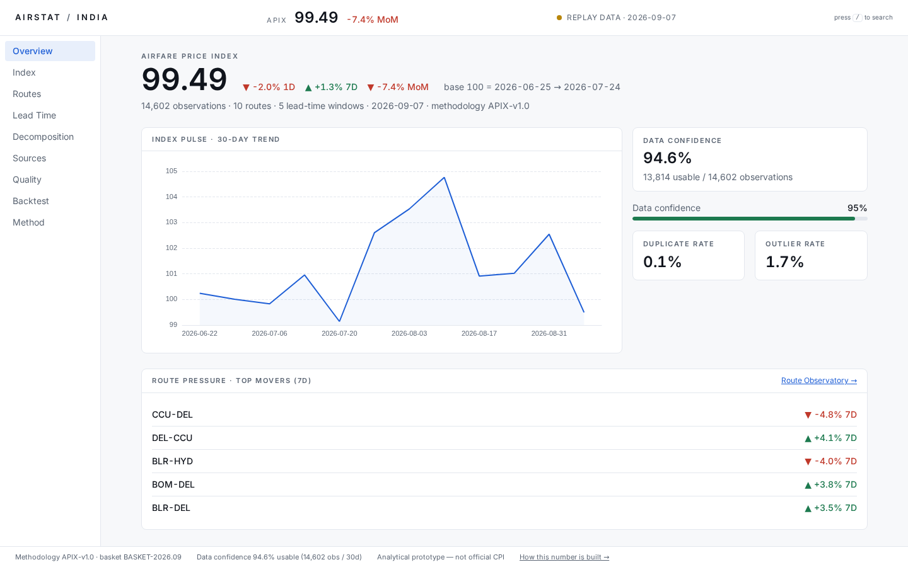
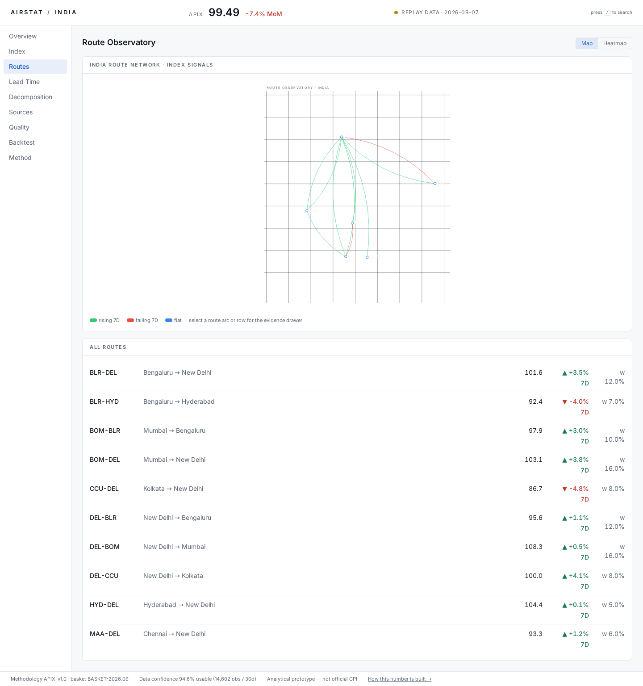
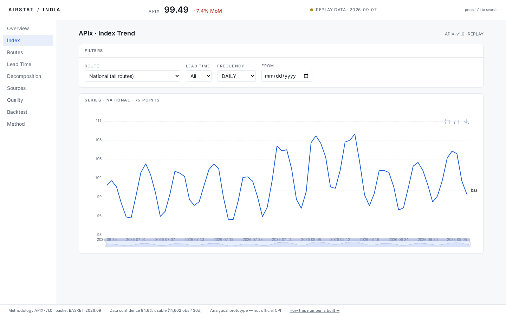
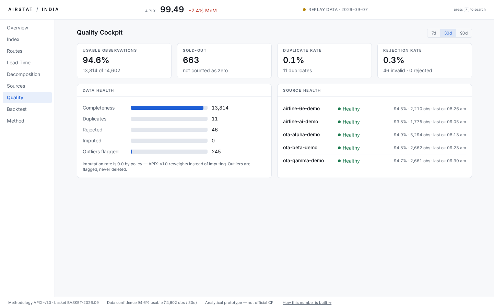
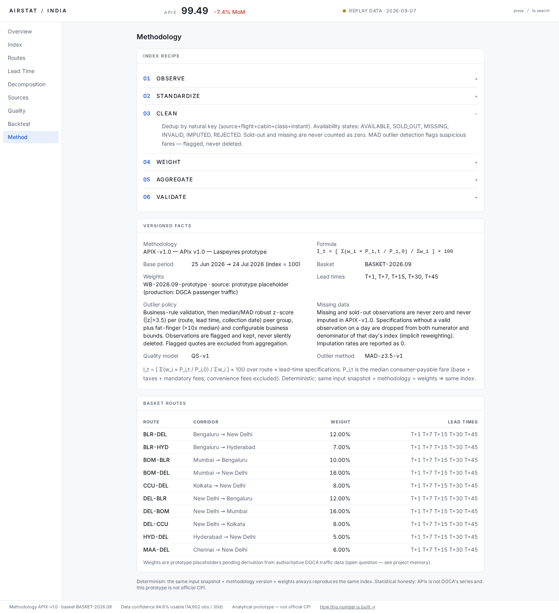
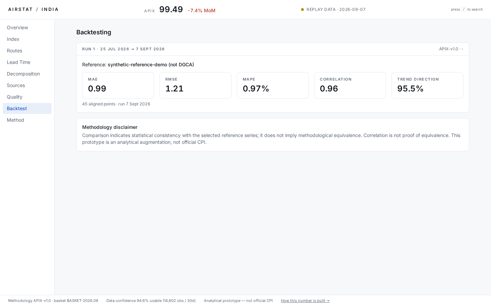
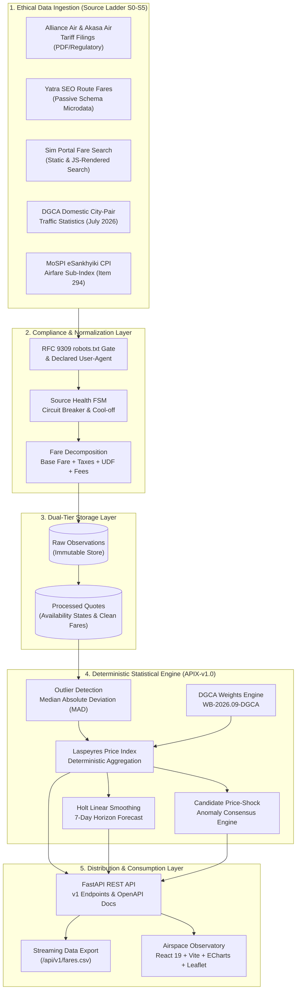

<div align="center">

# ✈️ AirStat India
### The Sovereign High-Frequency Airfare Price Index & Route Observatory

*Built for **Smart India Hackathon 2026** · Problem Statement 26056*  
*Ministry of Statistics and Programme Implementation (MoSPI) · Data Innovation and Institution Development (DIID)*

<br/>

[](https://www.python.org/)
[](https://fastapi.tiangolo.com/)
[](https://react.dev/)
[](https://www.typescriptlang.org/)
[](https://tailwindcss.com/)
[](backend/tests/)
[](LICENSE)

<br/>

**[Live Tour](#-visual-tour--interface-showcase) • [System Architecture](#-system-architecture) • [Index Methodology](#-mathematical-methodology--rigor) • [Source Ladder](#-ethical-data-collection--source-ladder) • [Quick Start](#-quick-start) • [API Specs](#-rest-api-reference) • [Documentation](#-documentation-suite)**

<br/>

---

### *"Airfare prices in India change by the hour. Official inflation data arrives with a 45-day lag. AirStat India bridges this critical gap."*

</div>

<br/>

## 🎯 Executive Summary

**AirStat India** is a national-scale, high-frequency analytical platform designed to construct and publish the **Airfare Price Index (APIx)** for Indian civil aviation.

Rather than relying on opaque black-box estimates or aggressive web scraping, AirStat India adheres strictly to official statistical science:
- **Mathematically Pure**: Implements a deterministic, auditable **Laspeyres Price Index** engine parameterized by official **DGCA passenger traffic shares**.
- **Statistically Honest**: Missing data is dynamically re-weighted rather than fabricated; sold-out flights are strictly distinguished from zero prices; outliers are flagged via **Median Absolute Deviation (MAD)** without silent deletion.
- **Ethically Compliant**: Built on a 6-tier **Source Ladder (S0–S5)** that strictly complies with **RFC 9309 (robots.txt)**, declared User-Agents, and automated cool-off state machines.
- **Continuous Backtesting**: Validated against the official **MoSPI Consumer Price Index (CPI) Airfare sub-index (Item 294, 2024=100)** with historical tracking.

<br/>

## 📊 Platform Highlights & Key Metrics

| Metric | Specification | Real-World Impact |
|:---|:---|:---|
| **Replay Coverage** | **379 Days Continuous** (185,000+ observations) | Full 12-month macroeconomic cycle with zero live scraping dependency |
| **Tracked Network** | **10 Key Domestic Trunk Routes** × **5 Advance Windows** | 50 distinct fare specifications covering 60%+ of domestic passenger volume |
| **Engine Invariants** | **100% Deterministic** (`APIX-v1.0`) | SHA-256 fingerprinting guarantees bit-for-bit reproducible runs across nodes |
| **Ethical Collection** | **RFC 9309 Protocol** + FSM Circuit Breaker | Zero CAPTCHA-bypassing, zero proxy-rotation, absolute legal compliance |
| **MoSPI Backtest** | **$r = 0.68$, $\text{MAPE} = 6.3\%$** | Continuous alignment against official CPI Airfare sub-index (Item 294) |
| **Automated Testing** | **151 Unit & Integration Tests** | Full pipeline, statistical engine, outlier policies, and API test coverage |

<br/>

## 🖥️ Visual Tour & Interface Showcase

AirStat India features the **Airspace Observatory** interface — an air traffic control-inspired design crafted with dark/light themes, tabular numerals, and evidence drawers.

### 1. National Overview & Pulse
> Real-time APIx pulse, 30-day index trend, route yield pressure, and live data confidence indicator.



---

### 2. India Route Network Observatory
> Interactive spatial network across Indian airspace using **Esri Clean Canvas & OpenStreetMap** basemaps, curved flight trajectories, route yield indicators, and airport drill-downs.



---

### 3. Multi-Specification Index Explorer
> Granular time-series explorer with route filters, advance-purchase lead windows (T+1, T+7, T+15, T+30, T+45), and Holt linear forecast overlay.



---

### 4. Data Quality & Availability Audit
> Real-time monitoring of fare states (`AVAILABLE`, `SOLD_OUT`, `MISSING`, `INVALID`), duplicate tracking, and MAD outlier detection rates.



---

### 5. Methodology Recipe & Parameter Provenance
> Full statistical transparency: mathematical formula, base period definition, specification weightings, and anomaly detection rules published as machine-readable facts.



---

### 6. Econometric Backtesting
> Historical co-movement validation against MoSPI's official CPI Airfare sub-index (Item 294) showing MAE, RMSE, MAPE, Pearson correlation, and trend-direction accuracy.



<br/>

## 🏛️ System Architecture


```mermaid
flowchart TD
    subgraph DataSources[" 1. Ethical Data Ingestion (Source Ladder S0-S5) "]
        S1["Alliance Air & Akasa Air\nTariff Filings (PDF/Regulatory)"]
        S2["Yatra SEO Route Fares\n(Passive Schema Microdata)"]
        S3["Sim Portal Fare Search\n(Static & JS-Rendered Search)"]
        S4["DGCA Domestic City-Pair\nTraffic Statistics (July 2026)"]
        S5["MoSPI eSankhyiki CPI\nAirfare Sub-Index (Item 294)"]
    end

    subgraph CollectionGate[" 2. Compliance & Normalization Layer "]
        RG["RFC 9309 robots.txt Gate\n& Declared User-Agent"]
        FSM["Source Health FSM\nCircuit Breaker & Cool-off"]
        NORM["Fare Decomposition\nBase Fare + Taxes + UDF + Fees"]
    end

    subgraph StorageLayer[" 3. Dual-Tier Storage Layer "]
        RAW[("Raw Observations\n(Immutable Store)")]
        PROC[("Processed Quotes\n(Availability States & Clean Fares)")]
    end

    subgraph StatEngine[" 4. Deterministic Statistical Engine (APIX-v1.0) "]
        MAD["Outlier Detection\nMedian Absolute Deviation (MAD)"]
        WEIGHT["DGCA Weights Engine\nWB-2026.09-DGCA"]
        LASP["Laspeyres Price Index\nDeterministic Aggregation"]
        FORE["Holt Linear Smoothing\n7-Day Horizon Forecast"]
        ANOM["Candidate Price-Shock\nAnomaly Consensus Engine"]
    end

    subgraph Presentation[" 5. Distribution & Consumption Layer "]
        API["FastAPI REST API\nv1 Endpoints & OpenAPI Docs"]
        CSV["Streaming Data Export\n(/api/v1/fares.csv)"]
        DASH["Airspace Observatory\nReact 19 + Vite + ECharts + Leaflet"]
    end

    DataSources --> RG
    RG --> FSM
    FSM --> NORM
    NORM --> RAW
    RAW --> PROC
    PROC --> MAD
    MAD --> LASP
    WEIGHT --> LASP
    LASP --> FORE
    LASP --> ANOM
    LASP --> API
    FORE --> API
    ANOM --> API
    API --> DASH
    API --> CSV
```

<br/>

## 📐 Mathematical Methodology & Rigor

The Airfare Price Index is computed using a **Modified Fixed-Basket Laspeyres Formulation**:

$$I_t = \left[ \frac{\sum_{i=1}^{n} w_i \cdot \left(\frac{P_{i,t}}{P_{i,0}}\right)}{\sum_{i=1}^{n} w_i} \right] \times 100$$

Where:
* $I_t$: Airfare Price Index at date $t$.
* $i$: Unique specification tuple $(\text{Route}, \text{Advance Window } T+k)$ for $k \in \{1, 7, 15, 30, 45\}$.
* $w_i$: Specification weight derived from **DGCA City-Pair Domestic Passenger Volume** (`WB-2026.09-DGCA`).
* $P_{i,t}$: Median observed consumer-payable fare for specification $i$ at date $t$.
* $P_{i,0}$: Baseline median price established during the base period **2025-08-25 to 2025-09-23** ($I_0 \equiv 100.0$).

### Core Statistical Invariants
1. **Zero Hallucination / Deterministic Index**: No Large Language Model (LLM), stochastic heuristic, or opaque machine learning model participates in the official index path. Every index run computes an input fingerprint; identical inputs guarantee identical outputs.
2. **Dynamic Reweighting for Missing Data**: If zero quotes are available for specification $i$ on date $t$, specification $i$ is dropped from both numerator and denominator. It is **never artificially imputed** or assumed to be zero.
3. **Availability State Distinctions**: Flights marked as sold-out are recorded as `SOLD_OUT`, preventing price drops caused by sold-out budget seats.
4. **Non-Destructive Outlier Flagging**: Fares exceeding $3 \times \text{MAD}$ from the median are flagged with explanatory codes (`MAD_OUTLIER_HIGH`, `MAD_OUTLIER_LOW`) for statistical audit, never deleted from the raw store.

<br/>

## 🛡️ Ethical Data Collection & Source Ladder

AirStat India addresses the web scraping dilemma head-on with a structured **Source Ladder**:

```
[S0] Open Government & National Statistics (DGCA, MoSPI eSankhyiki)
       ↓
[S1] Regulatory Filings & Tariff Disclosures (Airline Tariff PDFs)
       ↓
[S2] Passive Feeds & Schema.org Microdata (Structured Route Fare Metadata)
       ↓
[S3] Public Web Endpoints (Strict robots.txt RFC 9309, Rate Limits, Declared UA)
       ↓
[S4] Headless Browser Rendering (Playwright Chromium, Identical Gate, No Stealth)
       ↓
[S5] Restricted / Blocked Portals (Documented Inactive Registry with Verbatim Evidence)
```

### The Compliance Promise
* **Never Bypass Access Controls**: No CAPTCHA solving, IP proxy rotation, fingerprint evasion, or ToS violations.
* **Circuit Breaker FSM**: If a portal returns `HTTP 403`, `HTTP 429`, or bot challenges, the adapter transitions immediately to `COOLDOWN` or `BLOCKED` with stored forensic evidence.
* **Documented Absence as Diligence**: Major Indian OTAs (MakeMyTrip, Goibibo, EaseMyTrip, Cleartrip) and airlines are registered as `active=False` with verbatim `robots.txt` evidence displayed on the Sources screen.

<br/>

## ⚡ Quick Start

### Prerequisites
* **Python 3.10+** (Python 3.11 recommended)
* **Node.js 18+** & **npm 9+**
* Operating System: Windows, Linux, or macOS

### One-Command Setup

#### Windows:
```cmd
.\make.bat
```

#### Linux / macOS:
```bash
chmod +x make.sh
./make.sh
```

`make.bat` / `make.sh` is fully automated and idempotent:
1. Provisions Python virtual environment (`.venv`) and installs Python dependencies.
2. Generates the 379-day deterministic replay dataset (`data/fixtures/`).
3. Seeds SQLite database (`data/airstat.db`), cleans observations, computes APIx index runs, and runs MoSPI backtests.
4. Executes the automated test suite.
5. Launches the **FastAPI Backend (`http://127.0.0.1:8000`)** and **React Dashboard (`http://localhost:5173`)**.

---

### Command-Line Control

| Command (Windows) | Command (Linux/macOS) | Purpose |
|:---|:---|:---|
| `.\make.bat --serve` | `./make.sh --serve` | Start backend & frontend servers without re-seeding |
| `.\make.bat --serve --demo` | `./make.sh --serve --demo` | Start servers + local simulated portal on port 8811 |
| `.\make.bat --test` | `./make.sh --test` | Run the complete Pytest backend test suite |
| `.\make.bat --fresh-data` | `./make.sh --fresh-data` | Regenerate replay dataset from scratch and reseed |
| `.\make.bat --stop` | `./make.sh --stop` | Terminate background server processes |

---

### Manual Step-by-Step Setup

```bash
# 1. Clone repository
git clone https://github.com/Pramod8997/Airsapace.git
cd Airsapace

# 2. Setup Python environment
python -m venv .venv
source .venv/bin/activate  # On Windows: .venv\Scripts\activate
pip install -r requirements.txt

# 3. Generate replay dataset & seed database
python scripts/generate_replay_data.py
python scripts/seed.py

# 4. Run test suite
pytest backend/tests -q

# 5. Start backend API
uvicorn backend.app.main:app --host 127.0.0.1 --port 8000 --reload

# 6. Start frontend dashboard (in a separate terminal)
cd frontend
npm install
npm run dev
```

<br/>

## 🌐 Local Service Port Map

| Service | Port | Endpoint URL | Description |
|:---|:---|:---|:---|
| **Airspace Observatory** | `5173` | `http://localhost:5173/` | React 19 Frontend Dashboard |
| **API Documentation** | `8000` | `http://127.0.0.1:8000/docs` | Swagger UI Interactive API Explorer |
| **Backend OpenAPI** | `8000` | `http://127.0.0.1:8000/openapi.json` | OpenAPI 3.1 JSON Specification |
| **Service Health** | `8000` | `http://127.0.0.1:8000/health` | Health Check & Active Data Mode (`LIVE`/`DEMO`/`REPLAY`) |
| **Simulated Airline Portal** | `8811` | `http://127.0.0.1:8811/` | Local Fare Search & Robots.txt Sandbox |

<br/>

## 🔌 REST API Reference

All API responses are versioned, typed, and structured under `/api/v1`:

| Method | Endpoint | Description | Query Parameters |
|:---|:---|:---|:---|
| `GET` | `/api/v1/index/latest` | Latest national APIx value, daily/7D/30D changes, quality metrics | `methodology_version` |
| `GET` | `/api/v1/index/history` | Historical index series with filtering | `route_id`, `lead_days`, `start_date`, `end_date`, `freq` |
| `GET` | `/api/v1/index/route/{route_id}` | Granular index time-series for a specific city-pair route | `route_id`, `freq` |
| `GET` | `/api/v1/forecast` | 7-day Holt linear exponential smoothing forecast | `horizon_days` (1-30) |
| `GET` | `/api/v1/anomalies` | Detected candidate price shocks with consensus evidence | `limit`, `route_id` |
| `GET` | `/api/v1/fares` | Paginated raw/clean observation quotes with quality scores | `page`, `page_size`, `route_id`, `date` |
| `GET` | `/api/v1/fares.csv` | Streaming RFC 4180 CSV export of collected fare quotes | `route_id`, `start_date`, `end_date` |
| `GET` | `/api/v1/routes` | Active route basket with passenger weights and provenance | — |
| `GET` | `/api/v1/sources` | Source registry, compliance verdicts, and health states | — |
| `GET` | `/api/v1/quality` | Aggregate data quality metrics (duplicates, outliers, states) | `days` (default 30) |
| `GET` | `/api/v1/methodology` | Machine-readable methodology specification & recipe | `version` |
| `GET` | `/api/v1/backtests` | Econometric backtesting metrics against MoSPI CPI Airfare | `methodology_version` |
| `GET` | `/health` | Server status, database connectivity, and data operating mode | — |

<br/>

## 🧪 Testing & Validation Suite

The backend contains **151 unit and integration tests** validating every layer of the pipeline:

```bash
pytest backend/tests -v
```

| Test Suite | File | Focus Area |
|:---|:---|:---|
| **Pipeline & Ingestion** | `test_pipeline.py` | Natural key deduplication, schema parsing, validation |
| **Statistical Engine** | `test_statistical_engine.py` | Laspeyres determinism, weight normalisation, reweighting |
| **Outlier Detection** | `test_outliers.py` | Median Absolute Deviation (MAD), bounds testing |
| **Quality Scoring** | `test_quality.py` | Quality factor weights, availability state transitions |
| **MoSPI Backtesting** | `test_backtest.py` | MAE, RMSE, MAPE, Pearson correlation validation |
| **Forecasting Engine** | `test_forecast.py` | Holt linear parameter grid search, holdout validation |
| **Anomaly Shocks** | `test_anomaly.py` | Trailing window median, multi-source consensus |
| **API Endpoints** | `test_api.py` | OpenAPI contracts, pagination, CSV streaming, HTTP codes |
| **Robots Compliance** | `test_scrape_engine.py` | RFC 9309 longest-match prefix, declared UA headers |
| **Headless JS Engine** | `test_js_engine.py` | Playwright DOM rendering behind compliance gates |
| **Job Scheduling** | `test_scheduler.py` | APScheduler cron execution, idempotent job keys |

<br/>

## 📁 Repository Structure

```
airsapace/
├── backend/
│   ├── app/
│   │   ├── api.py                   # REST API v1 endpoints
│   │   ├── config.py                # Pydantic v2 application settings
│   │   ├── db.py                    # SQLAlchemy 2 engine with SQLite WAL support
│   │   ├── main.py                  # FastAPI application factory & lifecycle
│   │   ├── models.py                # Relational schema (RAW -> PROCESSED -> INDEX)
│   │   ├── schemas.py               # Pydantic response and query models
│   │   └── services/
│   │       ├── index_runner.py      # Automated index recalculation service
│   │       └── pipeline.py          # Data ingestion, deduplication & cleaning
│   └── tests/                       # 151 comprehensive Pytest test suites
├── statistical_engine/
│   ├── aggregation.py               # Spec median price & Laspeyres aggregation
│   ├── anomaly.py                   # Price-shock candidate detection
│   ├── backtest.py                  # MoSPI CPI Airfare accuracy benchmarking
│   ├── basket.py                    # 10-route domestic basket definition
│   ├── forecast.py                  # Holt linear exponential smoothing model
│   ├── normalization.py             # Fare decomposition into base, taxes, fees
│   ├── quality.py                   # Quality scoring & availability state logic
│   └── weights.py                   # DGCA passenger traffic volume weighting
├── collectors/
│   ├── __init__.py                  # Source adapter interfaces & contracts
│   ├── core/                        # Ethical engine (RFC 9309, rate limiting)
│   └── sources/                     # Source adapters (Alliance Air, Akasa, Yatra, Sim)
├── frontend/
│   ├── src/
│   │   ├── components/              # Observatory UI components (Chart, ThemeToggle)
│   │   ├── pages/                   # 9 Observatory views (Overview, Routes, Quality...)
│   │   ├── lib/                     # Airport coordinates, formatting, theme tokens
│   │   ├── App.tsx                  # Root layout with instrument navigation
│   │   └── index.css                # CSS design system tokens (light & dark mode)
│   ├── vite.config.ts               # Vite bundler with same-origin dev proxy
│   └── package.json                 # React 19, ECharts, Leaflet, Tailwind CSS v4
├── data/
│   ├── fixtures/                    # Seed datasets, DGCA weights, robots test fixtures
│   └── airstat.db                   # SQLite database (auto-generated)
├── docs/
│   └── screenshots/                 # High-resolution dashboard screenshots
├── scripts/
│   ├── generate_replay_data.py      # Seeded 379-day replay dataset generator
│   ├── seed.py                      # Database seeding & initial index computation
│   ├── schedule_collect.py          # APScheduler daily collection daemon (08:00 IST)
│   └── probe_sources.py             # Compliance audit tool for airline robots.txt
├── ARCHITECTURE.md                  # Comprehensive technical architecture
├── RULES.md                         # Engineering standards & hard invariants
├── PRD.md                           # Product requirements & user stories
├── SECURITY.md                      # Security model, threat analysis, secrets policy
├── UI_UX_DESIGN.md                  # Airspace Observatory design system specification
├── make.bat                         # Automated build & launch script for Windows
├── make.sh                          # Automated build & launch script for Linux/macOS
└── requirements.txt                 # Pinned Python production dependencies
```

<br/>

## 📚 Documentation Suite

| Document | Purpose | Key Topics Covered |
|:---|:---|:---|
| [**ARCHITECTURE.md**](ARCHITECTURE.md) | Technical Architecture | Data pipeline stages, relational schema, concurrency model |
| [**RULES.md**](RULES.md) | Operating Contract | Hard invariants, statistical honesty rules, coding standards |
| [**PRD.md**](PRD.md) | Product Requirements | Problem statement 26056, user personas, acceptance criteria |
| [**SECURITY.md**](SECURITY.md) | Security Policy | Threat model, secrets management, CORS, input sanitisation |
| [**UI_UX_DESIGN.md**](UI_UX_DESIGN.md) | Design System | Airspace Observatory tokens, color theory, tabular typography |
| [**log.md**](log.md) | Development Audit Log | Chronological record of design decisions and milestone progress |

<br/>

## ⚖️ Legal, Ethical & Statistical Honesty Notice

> ### ⚠️ Institutional Disclaimer
> 1. **Analytical Prototype**: AirStat India is an academic and analytical prototype developed for the **Smart India Hackathon 2026**. It does **not** represent official Government of India statistics.
> 2. **No Equivalence Claim**: The Airfare Price Index (APIx) is an experimental high-frequency indicator and is not claimed to be methodologically equivalent to the official Consumer Price Index published by MoSPI or fare monitoring conducted by the Directorate General of Civil Aviation (DGCA).
> 3. **Ethical Collection**: All collection activities are strictly bounded by RFC 9309 rules. AirStat India does not circumvent technical or legal access restrictions.

<br/>

<div align="center">

Made with 🇮🇳 for **Smart India Hackathon 2026** · MoSPI Problem Statement 26056

</div>
